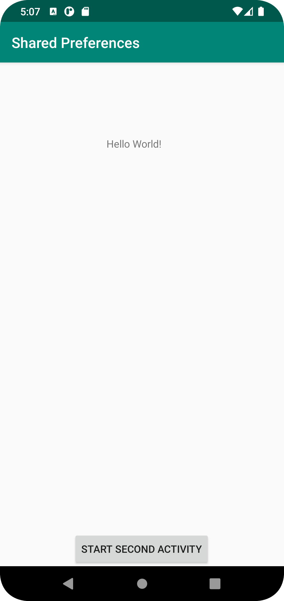
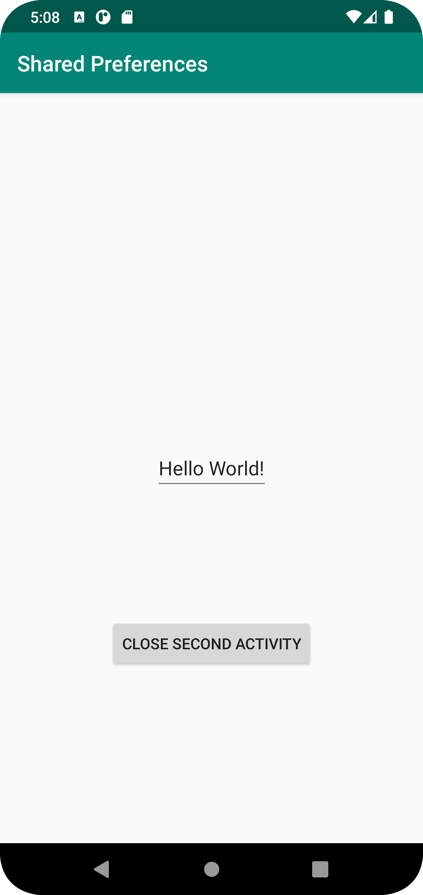
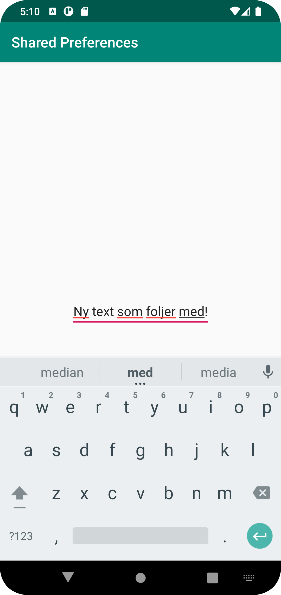

# Rapport

**Skriv din rapport här!**

skapat Shared preferences, skapat en second activity lagt till button med findView.. och setOnClickL..
för att knappen ska navigera mellan aktiviteterna. Med SharedPreferences, getSharedPre.. och String name, tillsammans med 
edittext har jag gjor så att den text jag implementerar i second aktivity ska synas i main när jag closar. 


```
        SharedPreferences myPreferences = getSharedPreferences("preferences", Context.MODE_PRIVATE);
        String name = myPreferences.getString("name", "hittade inget namn");
        textViewName.setText(name);
        Toolbar toolbar = findViewById(R.id.toolbar);
        setSupportActionBar(toolbar);
        Button button = findViewById(R.id.start_second_activity);
        button.setOnClickListener(new View.OnClickListener() {
```
Denna kod som applicerar texten ligger i second activity. 
```
       @Override
            public void onClick(View view) {
                SharedPreferences myPreferences = getSharedPreferences("preferences", Context.MODE_PRIVATE);
                SharedPreferences.Editor editor = myPreferences.edit();
                EditText editText = findViewById(R.id.name);
                String name = editText.getText().toString();
                editor.putString("name", name);
                editor.apply();
                finish();
            }
        });
```

Bilder läggs i samma mapp som markdown-filen.






Läs gärna:

- Boulos, M.N.K., Warren, J., Gong, J. & Yue, P. (2010) Web GIS in practice VIII: HTML5 and the canvas element for interactive online mapping. International journal of health geographics 9, 14. Shin, Y. &
- Wunsche, B.C. (2013) A smartphone-based golf simulation exercise game for supporting arthritis patients. 2013 28th International Conference of Image and Vision Computing New Zealand (IVCNZ), IEEE, pp. 459–464.
- Wohlin, C., Runeson, P., Höst, M., Ohlsson, M.C., Regnell, B., Wesslén, A. (2012) Experimentation in Software Engineering, Berlin, Heidelberg: Springer Berlin Heidelberg.
